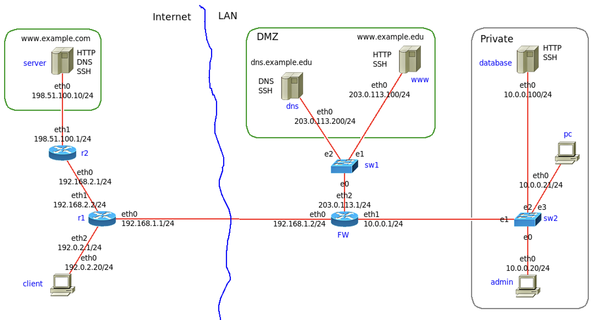

# Computer Security, 2023/2024
# Fourth lab exercise: Network protocol security and the firewall

Log in to the virtual machine and get the latest version:
```
$ cd ~/srs-lab/Lab4
$ git pull
```
If the directory `~/srs-lab` does not exist, get it from the GitLab with the command: 
```
$ git clone https://gitlab.tel.fer.hr/srs/srs-lab.git
$ cd srs-lab/Lab4
```
In the file `NETWORK.imn` you will find an example of a small local network `LAN`, with a demilitarized zone `DMZ` and a private part `Private`. 

The `client` and `server` computers are located in the external network (Internet), `dns` and `www` are located in the DMZ and the `database`, `pc` and `admin` are located in the protected part of the local network, `Private`.

The local network `LAN` is connected to the `Internet` via the router `FW`.

<!---
 
-->


Call `imunes` as root user, with a prepared topology (`NETWORK.imn`) and start the experiment: Experiment -> Execute:
```
$ sudo imunes NETWORK.imn
```
Network services: Telnet, FTP and SSH are started automatically on all nodes.

Call the `prepare.sh` shell script, which will configure additional services and start the DNS server on the `dns` and `server` nodes, and the WEB servers on the `www`, `server` and `database` nodes:
```
$ sudo ./prepare.sh 
```
You can check the running services on a local node with `ps` (running processes) and `netstat` (open ports):
```
$ sudo himage www
www# ps -ax
www# netstat -anp4
www# ss -an4
www# ss -anp4
```
### "Remote" checking of the availability of service 

You can check the availability of services from a "remote" computer by connecting to the server with a suitable client application or by "scanning" it with the `nmap` command.

From the Ubuntu terminal, you can run a command on a virtual node:
```
$ sudo himage naziv_čvora  naredba  arg1  arg2  ...
```
For example, check the availability of Telnet and SSH on the `server` and `www` nodes from the `pc` node.

Start Wireshark on the `eth0` interface of the node `FW`.

Open the terminal on the node `client` (double-click the icon or run `sudo himage client` from the terminal on Ubuntu) and try to connect to (`www`) using the TELNET and SSH protocols. You can enter any `login`/`password` as we are only interested in the beginning of the login process to the system.
```
$ sudo himage client
client# telnet 203.0.113.10
client# ssh 203.0.113.10
```

What can be seen in Wireshark? (You can use "Follow TCP stream")

```
$ sudo himage pc telnet 198.51.100.10
$ sudo himage pc ssh 203.0.113.10
```

You can check the availability of the web server on the `www` node from the `client` and `pc` nodes. Open the terminal and run the command:
```
# sudo himage client
client# curl http://www.example.edu/index.html
client# curl http://203.0.113.100/index.html

# sudo himage pc
pc# curl http://www.example.edu/index.html
pc# curl http://10.0.0.100:10000/index.html
```
or right-click on the `client`/`pc` node and select "Web Browser".

You can check DNS servers with the `host` command:
```
# himage client
client# host www.example.com
```

### Port scanning (nmap)

(Remote) Scanning the available services can also be carried out with the `nmap` tool. You can use the Wireshark tool to see the data traffic generated by the `nmap` scan.

For example, check the availability of TCP services on the `www` node in the demilitarized zone from the computers on the Internet (`client`):
```
$ himage client nmap -n -Pn "-p20-25,53,80,443" 203.0.113.100
```
Check the availability of TCP services on `www` node in the demilitarized zone from the computers in the private network (`pc` node):
```
$ sudo himage pc nmap -n -Pn "-p20-25,53,80,443" 203.0.113.100
```
Explore and try out the following options of the `nmap` tool:
- TCP and UDP port scanning
- TCP SYN Scan
- operating system detection (-O)
- service version detection (-sV)
- general scan (-A)

## Firewall configuration

Your task is to configure the firewall on the `FW` and to check the availability of services from the external network ("Internet") and from the local network ("LAN") according to the following requirements:

DMZ:

* The web server (TCP ports 80 and 443) on the `www` node, which is located in the demilitarized zone, can be accessed from any address (from the "Internet" and from the local network).
* The DNS server (UDP port 53 and TCP port 53) on the node `dns`, which is located in the demilitarized zone, can be accessed from any address (from the "Internet" and from the local network).
* For administration purposes, an SSH server is also started on the `www` and `dns` nodes, which can only be accessed from the `admin' computer from the "Private" part of the local network.
* From `www`, access to the `database` server ("Private") on TCP port 10000 and access to DNS servers on the Internet (UDP and TCP port 53) is permitted, everything else is prohibited.
* From `dns`, access to DNS servers on the Internet (UDP and TCP port 53) is allowed, everything else is prohibited.
* Access to all other addresses and servers in the DMZ is prohibited.

Private:
* Access to the SSH server on the `database` node, which is located in the local network "Private", is only permitted for computers from the "Private" network.
* Access to the web server on the `database` node (which listens on TCP port 10000) is only permitted from the `www` node in the DMZ (and from computers in the "Private" network).
* Access to all services on the Internet and in the DMZ from the node `database` is prohibited.
* All computers on the Internet can be accessed from computers in the local network (except from the node `database`), but only by using the HTTP (tcp/80 and tcp/443) and DNS (udp/53 and tcp/53) protocols.
* Access from the external network to the "Private" network is prohibited.

FW:
* The SSH server on the `FW` node can only be accessed from the `admin` node (in the "Private" network).
* Access to all other ports (services) on the `FW` node is prohibited.

### Firewall configuration shell script

The `FW.sh` shell script is used for the firewall configuration. You must add your rules to `FW.sh` according to the specified requirements.

Then copy the script to the `FW` node using the `hcp` command:
```
$ sudo hcp FW.sh FW:
```
and execute it on the `FW` node by calling the `himage` command:
```
$ sudo himage FW sh ./FW.sh
```
Another shell script, `install_fw.sh`, can also be used (it only calls hcp and himage):
```
$ sudo ./install_fw.sh
```

Instructions for `hcp` and `himage` can be found at:
https://github.com/imunes/imunes/wiki/Making-scripts-for-IMUNES.
 
IMPORTANT: After the firewall configuration, check the availability of the services according to the requirements. 


## Analysis of the captured network traffic

The file `syn_scan.pcap` contains a part of the network traffic that was recorede during the detection of open ports by the "TCP SYN scan".

Using tcpdump, Wireshark, or a third-party software tool, determine:

- From which IP addresses is the scan being performed?

- Which IP addresses are being scanned?

- Which scanned TCP ports are open?

- Which scanned TCP ports are closed?

## Results of the lab exercise

As a result of the lab exercise, you should upload a **ZIP archive** to Moodle containing the following:
- **description.txt** - a short summary report of the lab exercise (in the form of a txt file), which contains the procedure for solving the task,
- **FW.sh** - your version of the file `FW.sh` (the file name must be FW.sh)
