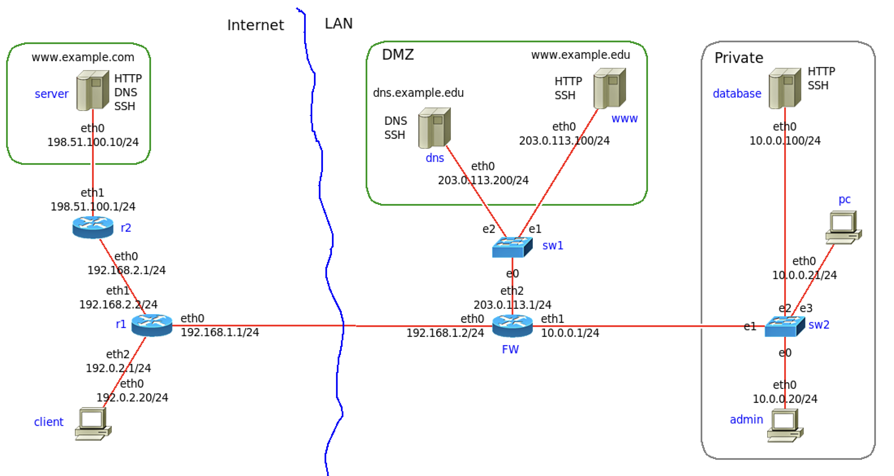

# Sigurnost računalnih sustava, ak. god. 2023./2024.
# Četvrta laboratorijska vježba: Sigurnost mrežnih protokola i vatrozid

Logirajte se na virtualni stroj i dohvatite najnoviju verziju:
```
$ cd ~/srs-lab/Lab4
$ git pull
```
Ako direktorij `~/srs-lab` ne postoji, dohvatite ga naredbom:
```
$ git clone https://gitlab.tel.fer.hr/srs/srs-lab.git
$ cd srs-lab/Lab4
```
U datoteci `NETWORK.imn` se nalazi primjer male lokalne mreže `LAN`, s demilitariziranom zonom `DMZ` i privatnim dijelom lokalne mreže `Private`. 

Računala `client` i `server` su u vanjskoj mreži (Internetu), `dns` i `www` su u DMZ, a `database`, `pc`  i `admin` se nalaze u zaštićenom dijelu lokalne mreže, `Private`.

Usmjeritelj `FW` povezuje lokalnu mrežu na `Internet`. 

<!---
 
-->


Kao korisnik `root` pozovite `imunes` s pripremljenom topologijom (`NETWORK.imn`) i pokrenite eksperiment, Experiment -> Execute:
```
$ sudo imunes NETWORK.imn
```
Na svim čvorovima će se automatski pokrenuti mrežne usluge: Telnet, FTP i SSH.

Pozovite shell skriptu `prepare.sh` koja će dodatno konfigurirati i pokrenuti DNS poslužitelj na čvorovima `dns` i`server` te WEB poslužitelje na čvorovima `www`, `server` i `database`:
```
$ sudo ./prepare.sh 
```
Pokrenute usluge možete provjeriti na pojedinom čvoru (lokalno) naredbama `ps` (ispis pokrenutih procesa) i `netstat` (ispis portova / pristupa):
```
$ sudo himage www
www# ps -ax
www# netstat -anp4
www# ss -an4
www# ss -anp4
```
### "Udaljena" provjera dostupnosti usluga

Dostupnost poslužitelja na "udaljenom" računalu možete provjeriti spajanjem na poslužitelj odgovarajućim klijentskim aplikacijama ili "skeniranjem" naredbom `nmap`. 

Iz Ubuntu terminala možete pokrenuti izvođenje naredbe na virtualnom čvoru pozivom:
```
$ sudo himage naziv_čvora  naredba  arg1  arg2  ...
```
Na primjer, s `pc` se pokušajte spojiti protokolima Telnet i SSH na `server` i `www`.

Pokrenite Wireshark na sučelju `eth0` čvora `FW`.

Otvorite terminal na čvoru `client` (dvoklik na ikonu ili `sudo himage client` iz terminala na Ubuntu) i pokušajte se spojiti na 203.0.113.100 (`www`) korištenjem protokola TELNET i SSH. Za `login`/`password` upišite bilo što jer nas zanima samo početak prijave na sustav.

```
$ sudo himage client
client# telnet 203.0.113.10
client# ssh 203.0.113.10
```

Što se vidi u Wiresharku? (Možete koristiti "Follow TCP stream")

```
$ sudo himage pc telnet 198.51.100.10
$ sudo himage pc ssh 203.0.113.10
```

Provjera dostupnosti web poslužitelja na računalu `www` s računala `client` i s računala `pc`:

Otvorite terminal i kao korisnik root (sudo su) pozovite:
```
# himage client
client# curl http://www.example.edu/index.html
client# curl http://203.0.113.100/index.html

# himage pc
pc# curl http://www.example.edu/index.html
pc# curl http://10.0.0.100:10000/index.html
```
ili desnim klikom na ikonu čvora `client`/`pc` odaberite i pokrenite "Web Browser".

Provjera dostupnosti DNS poslužitelja na čvoru www s čvora client:
```
# himage client
client# host www.example.com
```

### Skeniranje alatom nmap

Skeniranje dostupnih servisa može se provesti i alatom `nmap`.  Korištenjem alata Wireshark možete vidjeti promet koji alat `nmap` generira.

Na primjer, provjera dostupnosti TCP usluga u demilitariziranoj zoni (`www`) računalima iz Interneta (`client`):
```
$ himage client nmap -n -Pn "-p20-25,53,80,443" 203.0.113.100
```
Provjera dostupnosti usluga u demilitariziranoj zoni računalima iz privatne mreže (čvor `pc`):
```
$ sudo himage pc nmap -n -Pn "-p20-25,53,80,443" 203.0.113.100
```
Istražite i isprobajte sljedeće opcije u alatu `nmap`:
- skeniranje TCP i UDP portova
- TCP syn scan
- detekcija operacijskog sustava (-O)
- detekcija verzija servisa (-sV)
- općeniti scan (-A opcija)

## Konfiguracija vatrozida 

Vaš je zadatak konfigurirati vatrozid (engl. firewall) na `FW` te provjeriti dostupnost usluga iz vanjske mreže ("Interneta") i iz lokalne mreže ("LAN") u skladu sa sljedećim zahtjevima:

DMZ:

* Web poslužitelju (TCP port 80 i 443) na čvoru `www`, koji se nalazi u demilitariziranoj zoni, se može pristupiti s bilo koje adrese (iz Interneta i iz lokalne mreže).  
* DNS poslužitelju (UDP port 53 i TCP port 53) na čvoru `dns`, koji se nalazi u demilitariziranoj zoni, se može pristupiti s bilo koje adrese (iz Interneta i iz lokalne mreže).
* Za potrebe administriranja, na čvorovima `www` i `dns` pokrenut je i SSH poslužitelj kojem se može pristupiti samo s računala `admin` iz lokalne mreže "Private". 
* S `www` je dozvoljen pristup poslužitelju `database` ("Private") na TCP portu 10000 te pristup DNS poslužiteljima u Internetu (UDP i TCP port 53), a sve ostalo je zabranjeno.
* S `dns` je dozvoljen pristup DNS poslužiteljima u Internetu (UDP i TCP port 53), a sve ostalo je zabranjeno.
* Pristup svim ostalim adresama i poslužiteljima u DMZ je zabranjen.

Private:
* Pristup SSH poslužitelju na čvoru `database`, koji se nalazi u lokalnoj mreži "Private", dozvoljen je samo računalima iz mreže "Private".
* Pristup web poslužitelju na čvoru `database` (koji sluša na TCP portu 10000) dozvoljen je isključivo s računala `www` koje se nalazi u DMZ (i računalima iz mreže "Private").
* S računala `database` je zabranjen pristup svim uslugama u Internetu i u DMZ.
* S računala iz lokalne mreže (osim s `database`) se može pristupati svim računalima u Internetu ali samo korištenjem protokola HTTP (tcp/80) i DNS (udp/53 i tcp/53).
* Pristup iz vanjske mreže u lokalnu "Private" mrežu je zabranjen.

FW:
* Na `FW` je pokrenut SSH poslužitelj kojem se može pristupiti samo iz lokalne mreže i to samo sa čvora `admin`.
* Pristup svim ostalim uslugama (portovima) na čvoru `FW` je zabranjen.

### Skripta za konfiguriranje vatrozida

U direktoriju se nalazi shell skripta za konfiguriranje vatrozida, `FW.sh`, u koju trebate dodati svoja pravila u skladu s navedenim zahtjevima.

Skriptu kopirajte na čvor `FW` naredbom `hcp`:
```
$ sudo hcp FW.sh FW:
```
i izvedite na virtualnom čvoru FW pozivanjem naredbe `himage`:
```
$ sudo himage FW sh ./FW.sh
```
ili pozovite skriptu `install_fw.sh`:
```
$ sudo ./install_fw.sh
```

Upute za `hcp` i `himage` možete pronaći na stranici https://github.com/imunes/imunes/wiki/Making-scripts-for-IMUNES.
 
Nakon konfiguriranja vatrozida, ponovo provjerite dostupnost usluga prema zahtjevima iz zadatka.


## Analiza snimljenog mrežnog prometa

U datoteci `syn_scan.pcap` se nalazi dio mrežnog prometa snimljenog za vrijeme "TCP SYN scan" otkrivanja otvorenih pristupa (_portova_).
Uz pomoć programskih alata tcpdump, Wireshark ili nekog trećeg, odredite:

- S kojih IP adresa se izvodi skeniranje?

- Koje IP adrese se skenira?

- Koji skenirani TCP pristupi (portovi) su otvoreni?

- Koji skenirani TCP pristupi su zatvoreni?


## Rezultati laboratorijske vježbe

Kao rezultat laboratorijske vježbe na Moodle trebate predati **ZIP arhivu** koja će sadržavati:

- **opis.txt** - sažeti izvještaj o laboratorijskoj vježbi (u obliku txt datoteke) koji sadrži kratki opis postupka rješavanja zadataka i odgovore na pitanja 
- **FW.sh** - vaša verzija datoteke FW.sh (koja se MORA zvati FW.sh!)
